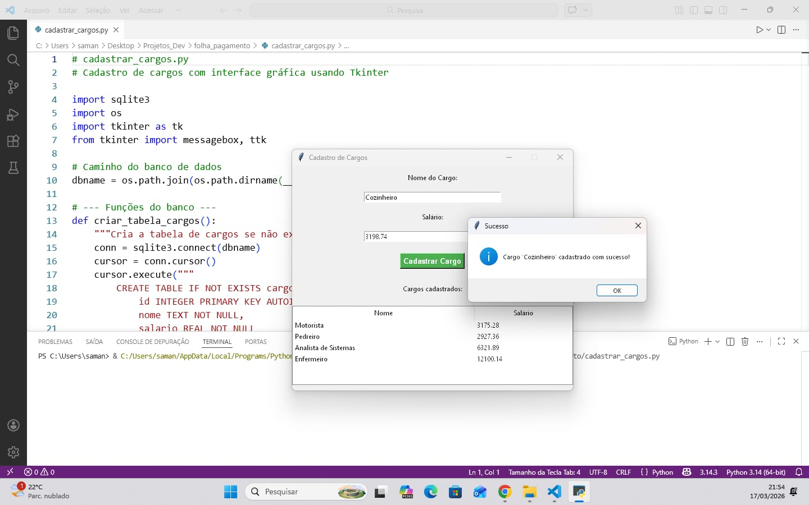
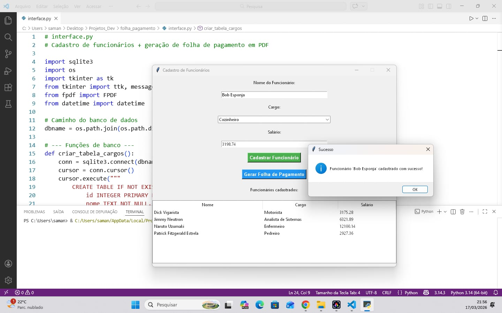
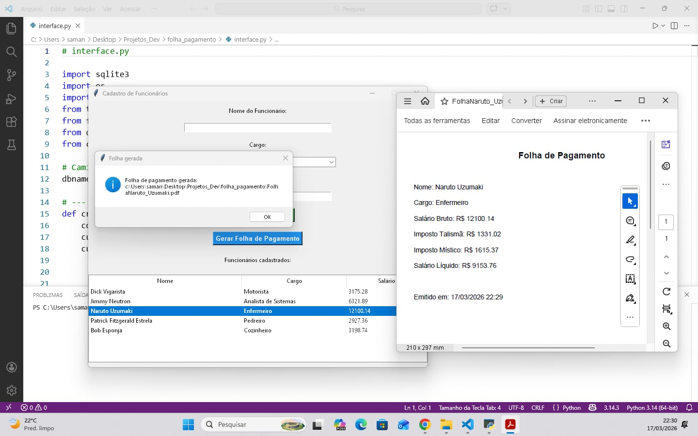
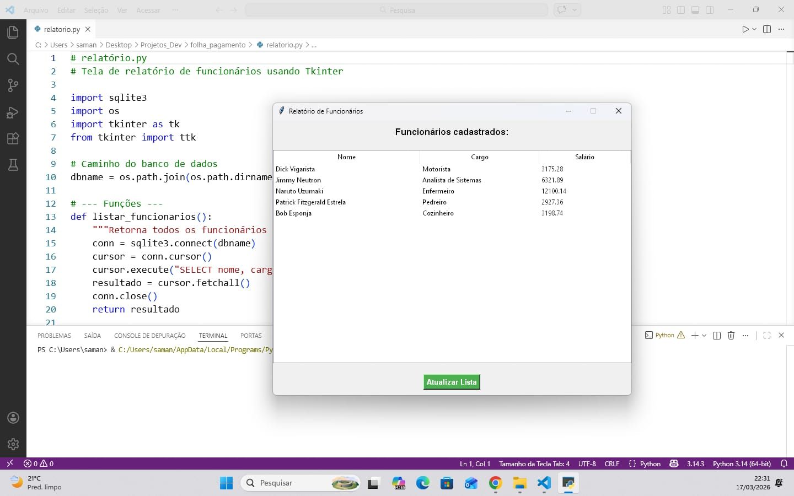

# Sistema de Folha de Pagamento em Python

Este projeto é um sistema desenvolvido em Python com interface gráfica para simular o funcionamento de uma folha de pagamento.
O sistema permite cadastrar cargos, cadastrar funcionários, calcular salários e gerar relatórios.

## Funcionalidades

- Cadastro de cargos;
- Cadastro de funcionários;
- Cálculo automático da folha de pagamento;
- Geração de relatório;
- Uso de banco de dados SQLite.

## Tecnologias utilizadas

- Python;
- Tkinter;
- SQLite.

## Imagens do sistema

### Cadastro de cargos

### Cadastro de funcionários

### Folha de pagamento gerada

### Relatório do sistema

